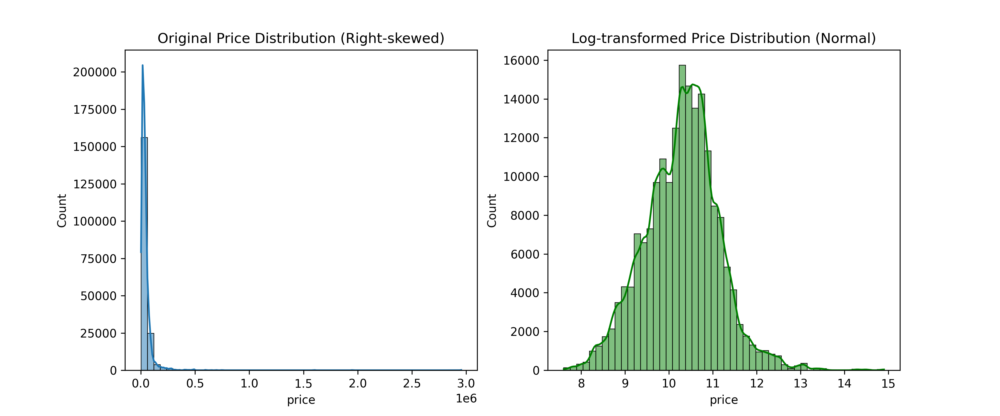
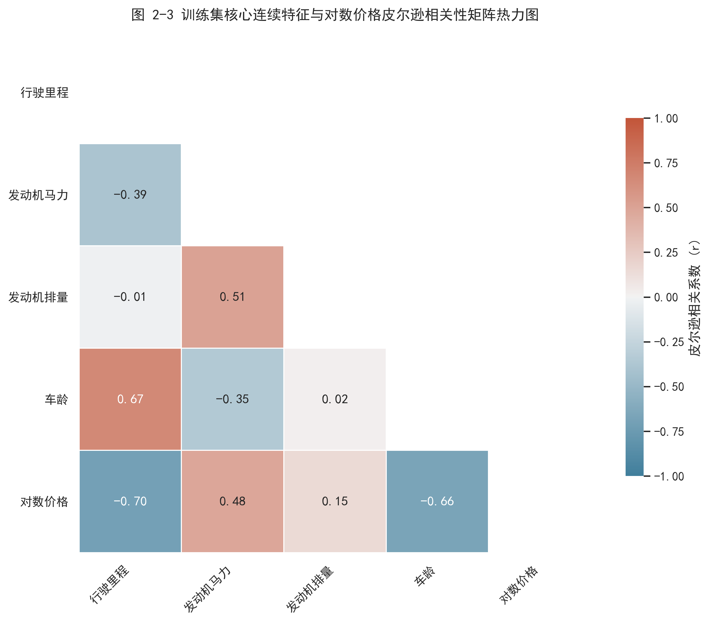
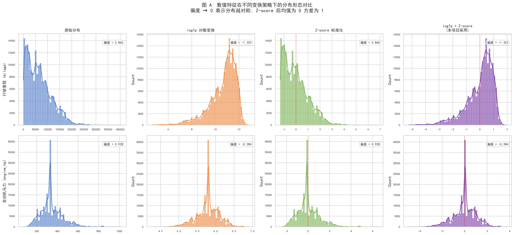
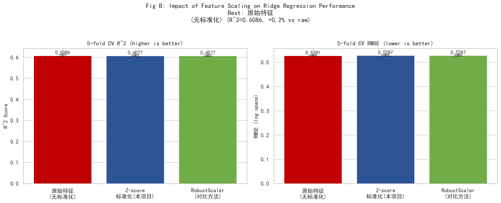
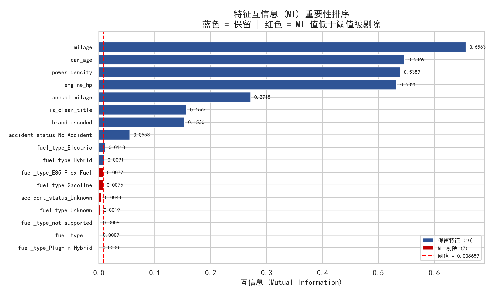

# 🚗 Used Car Price Prediction System · 二手车价格预测系统

[](https://www.python.org/)
[](https://scikit-learn.org/)
[](https://pandas.pydata.org/)
[](LICENSE)

基于真实二手车交易数据的**工业级价格预测系统**，涵盖从原始脏数据清洗、高维特征工程、特征选择降维到建模特征矩阵持久化的完整机器学习 Pipeline。

---

## 📋 目录

- [项目背景](#项目背景)
- [核心亮点](#核心亮点)
- [项目结构](#项目结构)
- [环境与依赖](#环境与依赖)
- [快速开始](#快速开始)
- [Pipeline 详解](#pipeline-详解)
  - [阶段 0：环境校验](#阶段-0环境校验)
  - [阶段 1：数据加载](#阶段-1数据加载)
  - [阶段 2：高级预处理](#阶段-2高级预处理)
  - [阶段 3：特征工程](#阶段-3特征工程)
  - [阶段 3.5：特征选择与降维](#阶段-35特征选择与降维)
  - [阶段 4：持久化输出](#阶段-4持久化输出)
- [EDA 可视化](#eda-可视化)
- [数据流图](#数据流图)
- [后续扩展](#后续扩展)

---

## 项目背景

二手车市场存在严重的信息不对称问题，买卖双方对车辆真实价值的判断往往依赖主观经验。本项目基于真实二手车交易数据集，构建了一套**端到端的特征工程 Pipeline**，通过对原始异构数据的系统化清洗与特征提取，为后续机器学习建模提供高质量、无数据泄露的特征矩阵。

### 技术栈

| 层级 | 技术选型 |
|------|----------|
| 语言 | Python 3.10+ |
| 数据处理 | Pandas, NumPy |
| 机器学习 | scikit-learn（TransformerMixin 管道化封装） |
| 特征选择 | VIF 多重共线性 + 互信息 (Mutual Information) |
| 可视化 | Matplotlib, Seaborn |
| 包管理 | uv（pyproject.toml） |

---

## 核心亮点

### 🛡️ 防数据泄露设计

- **五折嵌套隔离目标编码（Out-of-Fold Target Encoding）**：对品牌（brand）等高基数分类变量做目标编码时，严格采用 OOF 交叉验证方式计算编码值，杜绝训练集信息向验证集泄露。
- **fit / transform 分离**：所有预处理器和特征工程器均继承 `sklearn.base.BaseEstimator` 与 `TransformerMixin`，确保统计量仅在训练集上学习，测试集仅做静态映射。

### 🧹 自适应数据清洗

- **品牌名称标准化**：自动纠正拼写歧义（如 `Mercedes → Mercedes-Benz`、`VW → Volkswagen`）。
- **正则引擎特征抽取**：从非结构化引擎文本中自适应提取马力（HP）与排量（L），支持缺失 "L" 标注的备用匹配模式。
- **MAR 机制缺失值填充**：结合业务逻辑联动填充（如 Tesla 品牌自动归为 Electric 燃料类型）。
- **品牌级局部 IQR 截尾**：按品牌分组计算里程的局部 IQR 边界，避免高性能豪车被全局阈值"误杀"。

### 🔧 创新衍生特征

- **年均行驶里程** `annual_milage = milage / (car_age + 1)`：融合车龄与里程的复合特征，更精准反映车辆使用强度。
- **马力密度** `power_density = engine_hp / engine_liter`：单位排量输出的马力（升功率），反映发动机技术代际与性能定位。涡轮增压/高性能引擎 → 高 power_density → 性能溢价。
- **事故记录提炼**：将缺失值独立编码为 `Unknown` 类别，保留潜在欺诈行为模式供算法学习。

### 📊 特征选择与降维

- **第一轮 · VIF 多重共线性筛选**：迭代剔除 VIF > 10 的高度冗余特征，解决协方差矩阵不稳定问题。
- **第二轮 · 互信息重要性筛选**：计算各特征与对数价格的非参数依赖度，剔除 MI < 自适应阈值的弱相关特征。
- **详细剔除报告 + MI 排序图**：自动化输出筛选过程日志与可视化图表。

---

## 项目结构

```
UsedCarPricePredictionSystem/
├── run_pipeline.py                  # 🔥 主 Pipeline 执行脚本
├── pyproject.toml                   # 项目配置与依赖声明
├── .gitignore
├── .python-version                  # Python 版本锁定 (3.10)
│
├── src/                             # 核心源码模块
│   ├── config.py                    # 全局路径 & 参数配置
│   ├── preprocess.py                # 高级数据预处理器
│   ├── features.py                  # 特征工程器（衍生特征 + OOF 编码）
│   └── selection.py                 # 特征选择器（VIF + 互信息降维）
│
├── eda_plots/                       # 探索性数据分析脚本
│   ├── eda_target.py                # 目标变量分布对比（原始 vs Log 变换）
│   ├── eda_heatmap.py               # 特征相关性热力图
│   ├── eda_feature_transform.py     # 数值特征变换策略对比验证
│   └── eda_features_validation.py   # 衍生特征有效性综合验证
│
├── data/
│   ├── raw/                         # 原始数据（需自行准备）
│   │   ├── train.csv                # 训练集
│   │   └── test.csv                 # 测试集
│   └── processed/                   # 清洗后的特征矩阵（自动生成）
│       ├── train_features.csv
│       └── test_features.csv
│
├── models/                          # 模型持久化目录
│
└── reports/
    └── figures/                     # 可视化输出（自动生成）
        ├── price_distribution_comparison.png
        ├── feature_correlation_heatmap.png
        ├── feature_transform_distribution.png
        ├── feature_transform_model_impact.png
        ├── feature_mi_ranking.png
        ├── validation_brand_encoded.png
        ├── validation_power_density.png
        └── validation_annual_milage.png
```

> **注意**：`data/` 目录被 `.gitignore` 忽略。克隆项目后请自行创建 `data/raw/` 并放入 `train.csv` 与 `test.csv` 数据文件。

---

## 环境与依赖

### 前置要求

- Python >= 3.10
- [uv](https://github.com/astral-sh/uv)（推荐，用于快速依赖管理）

### 安装

```bash
# 1. 克隆项目
git clone https://github.com/yezixin1027/UsedCarPricePredictionSystem.git
cd UsedCarPricePredictionSystem

# 2. 创建数据目录并放入数据文件
mkdir -p data/raw
# 将 train.csv 和 test.csv 复制到 data/raw/ 目录下

# 3. 创建虚拟环境并安装依赖（使用 uv）
uv sync

# 或使用 pip（需先生成 requirements.txt）
uv export --format requirements-txt > requirements.txt
pip install -r requirements.txt
```

### 核心依赖

| 包名 | 版本 | 用途 |
|------|------|------|
| `pandas` | >= 2.3.3 | 数据加载与 DataFrame 操作 |
| `numpy` | >= 2.2.6 | 数值计算 |
| `scikit-learn` | >= 1.7.2 | Pipeline 基类封装、标准化、交叉验证、特征选择 |
| `matplotlib` | >= 3.10.9 | 基础绘图 |
| `seaborn` | >= 0.13.2 | 统计可视化（热力图、分布图） |
| `notebook` | >= 7.5.6 | Jupyter Notebook 支持 |

---

## 快速开始

### 运行完整 Pipeline

```bash
python run_pipeline.py
```

执行后将依次完成：
1. 环境校验（检查数据文件是否存在）
2. 加载原始 CSV 数据
3. 运行 `AdvancedUsedCarPreprocessor` 清洗预处理
4. 运行 `HighScoreFeatureEngineer` 特征工程
5. 运行 `FeatureSelector` 特征选择与降维
6. 将最终特征矩阵持久化至 `data/processed/`

### 生成 EDA 图表

```bash
# 目标变量分布对比图（原始 vs Log 变换）
python eda_plots/eda_target.py

# 特征相关性热力图
python eda_plots/eda_heatmap.py

# 数值特征变换策略对比验证（分布 + 模型性能）
python eda_plots/eda_feature_transform.py

# 衍生特征有效性综合验证（排列重要性 + 偏依赖 + 交叉验证）
python eda_plots/eda_features_validation.py
```

生成的图表自动保存至 `reports/figures/` 目录。

---

## Pipeline 详解

### 阶段 0：环境校验

运行前自动检查 `data/raw/train.csv` 与 `data/raw/test.csv` 是否存在，文件缺失时给出明确提示。

### 阶段 1：数据加载

```python
train_df = pd.read_csv(TRAIN_PATH)   # 训练集
test_df  = pd.read_csv(TEST_PATH)    # 测试集

# 严格拆分自变量与响应变量
X_train_raw = train_df.drop(columns=['price'])
y_train_raw = train_df['price']
```

### 阶段 2：高级预处理

`AdvancedUsedCarPreprocessor` 执行以下清洗步骤：

| 步骤 | 操作 | 说明 |
|------|------|------|
| 1 | 品牌标准化 | 统一非标准拼写（`Land → Land Rover`、`Chevy → Chevrolet`），保留原始 NaN |
| 2 | 稀有品牌归拢 | 样本量 < 15 的品牌合并为 `Other` |
| 3 | 引擎特征抽取 | 正则提取 `engine_hp`（马力）、`engine_liter`（排量） |
| 4 | 品牌级 IQR 截尾 | 按品牌局部截断 `milage` 极端异常值（IQR × 3.0） |
| 5 | 业务联动填充 | Tesla → Electric；缺失燃料类型归为 `Unknown` |
| 6 | 事故记录编码 | `accident` → `accident_status`（Has_Accident / No_Accident / Unknown） |
| 7 | 车龄计算 | `car_age = CURRENT_YEAR - model_year`（动态获取当前年份） |
| 8 | 特征裁剪 | 剔除高基数/冗余列（`engine`、`model`、`transmission` 等） |

### 阶段 3：特征工程

`HighScoreFeatureEngineer` 执行以下变换：

| 步骤 | 操作 | 说明 |
|------|------|------|
| 1 | 衍生特征构建 | `annual_milage`（年均行驶里程）+ `power_density`（马力密度/升功率） |
| 2 | OOF 目标编码 | 5 折交叉验证隔离编码 `brand` → `brand_encoded`，含拉普拉斯平滑 |
| 3 | One-Hot 编码 | 低基数分类变量（`fuel_type`、`accident_status`） |
| 4 | Z-score 标准化 | 连续特征零均值单位方差变换 |

### 阶段 3.5：特征选择与降维

`FeatureSelector` 执行两阶段自动筛选：

| 阶段 | 方法 | 阈值 | 说明 |
|------|------|------|------|
| 第一轮 | VIF 多重共线性 | VIF > 10 | 迭代剔除共线性最强的特征，稳定协方差矩阵 |
| 第二轮 | 互信息 (MI) | MI < 均值 × 5% | 剔除与对数价格统计依赖极弱的噪声特征 |

筛选完成后自动生成 MI 重要性排序图（`reports/figures/feature_mi_ranking.png`）与控制台详细剔除报告。

### 阶段 4：持久化输出

```python
train_final_output['log_price'] = np.log1p(y_train_raw)
train_final_output.to_csv("data/processed/train_features.csv", index=False)
X_test_selected.to_csv("data/processed/test_features.csv", index=False)
```

输出特征矩阵可直接用于 XGBoost、LightGBM、Random Forest 等任意监督学习模型的训练与预测。

---

## EDA 可视化

### 目标变量分布（Log 变换前后对比）



原始价格呈严重右偏分布，经过 `log1p` 变换后接近正态分布，更适合线性模型与梯度下降优化。

### 特征相关性热力图



展示核心连续特征（行驶里程、发动机马力、排量、车龄）与对数价格之间的皮尔逊相关系数。

### 数值特征变换策略对比




量化对比原始分布、log1p 对数变换、Z-score 标准化、log1p+Z-score 联合变换四种策略的分布改善（偏度）与模型性能影响（Ridge 回归 5 折 CV R² & RMSE）。

### 衍生特征有效性验证



综合使用排列重要性（Permutation Importance）、Bootstrap 置信区间、偏依赖图（Partial Dependence）与交叉验证性能对比，多维度验证 `brand_encoded`、`power_density`、`annual_milage` 三个衍生特征对预测的实质贡献。

---

## 数据流图

```
┌──────────────┐     ┌──────────────────────────┐     ┌──────────────────────────┐
│  data/raw/   │ ──► │ AdvancedUsedCarPreprocessor │ ──► │ HighScoreFeatureEngineer │
│ train.csv    │     │  · 品牌清洗 + 稀有归拢    │     │  · 衍生特征构建           │
│ test.csv     │     │  · 引擎特征抽取           │     │  · OOF 目标编码           │
└──────────────┘     │  · IQR 局部截尾           │     │  · One-Hot 编码           │
                     │  · 缺失值业务联动填充     │     │  · Z-score 标准化         │
                     │  · 车龄计算 + 特征裁剪    │     └──────────┬───────────────┘
                     └──────────────────────────┘                │
                                                                 ▼
                                                     ┌──────────────────────────┐
                                                     │  FeatureSelector         │
                                                     │  · VIF 共线性剔除        │
                                                     │  · 互信息重要性筛选      │
                                                     └──────────┬───────────────┘
                                                                │
                                                                ▼
                                                     ┌────────────────────┐
                                                     │  data/processed/   │
                                                     │  train_features.csv│
                                                     │  test_features.csv  │
                                                     └────────────────────┘
```

---

## 后续扩展

- [ ] 集成 XGBoost / LightGBM 模型训练模块
- [ ] 添加超参数网格搜索与交叉验证
- [ ] 构建模型可解释性分析（SHAP / Permutation Importance）
- [ ] 开发 Flask / FastAPI 推理服务接口
- [ ] 添加 CI/CD 自动化测试与部署
- [ ] 添加单元测试覆盖核心 Transformer
